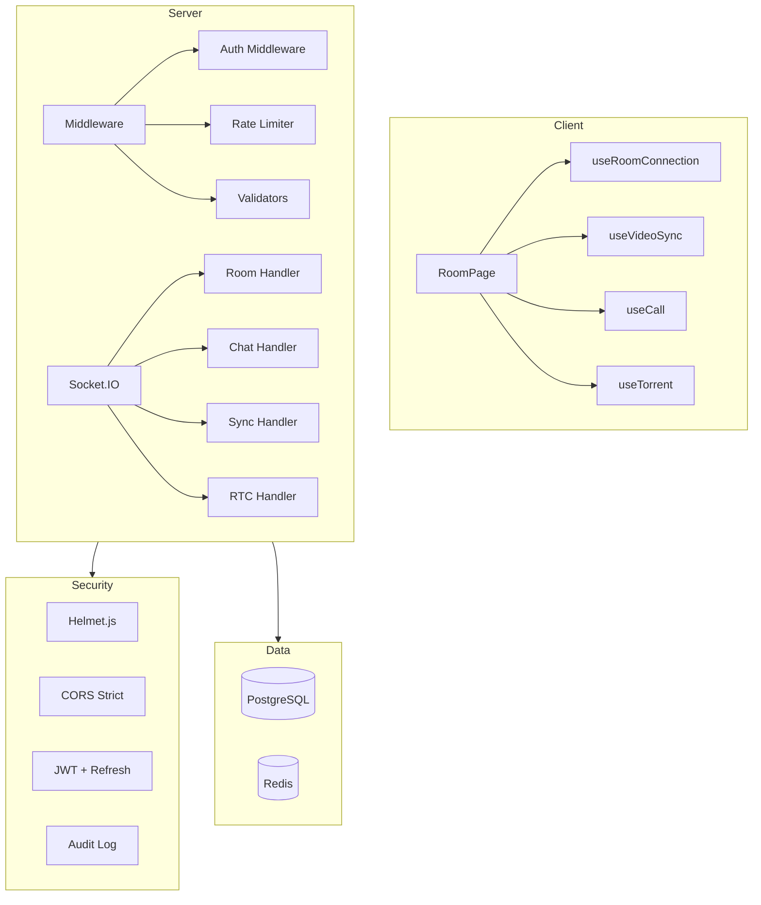

# Plan d'Amélioration StreamParty

Ce document présente un plan complet d'améliorations pour le projet StreamParty, organisé en trois axes: **Code**, **UI/UX**, et **Sécurité**.

---

## 1. Améliorations du Code

### 1.1 Refactoring du composant RoomPage

**Problème**: [`RoomPage.tsx`](client/src/pages/RoomPage.tsx) fait 688 lignes et gère trop de responsabilités.

**Solution**: Découper en composants et hooks personnalisés.

```typescript
// Nouvelle structure proposée
client/src/pages/RoomPage/
├── index.tsx              # Orchestration principale (~150 lignes)
├── hooks/
│   useRoomConnection.ts   # Gestion connexion socket room
│   useVideoSync.ts        # Logique synchronisation vidéo
│   useCall.ts             # Logique appels WebRTC
│   └── useTorrent.ts      # Logique chargement torrent
├── components/
│   RoomHeader.tsx         # Barre supérieure
│   VideoArea.tsx          # Zone vidéo + overlay
│   ChatSidebar.tsx        # Sidebar chat
└── types.ts               # Types locaux
```

**Priorité**: Haute

---

### 1.2 Gestion d'erreurs centralisée

**Problème**: Erreurs gérées de manière dispersée avec `console.error` et `addToast`.

**Solution**: Créer un service d'erreur centralisé.

```typescript
// client/src/services/errorHandler.ts
export class AppError extends Error {
  constructor(
    public code: string,
    message: string,
    public severity: 'error' | 'warning' | 'info' = 'error'
  ) { super(message); }
}

export const errorHandler = {
  handle(error: unknown, context?: string): void {
    // Log structuré
    logger.error(context, error);
    // Toast utilisateur
    toastStore.addToast(formatError(error), severity);
  }
};
```

**Priorité**: Moyenne

---

### 1.3 Tests unitaires et d'intégration

**Problème**: Couverture de tests minimale.

**Solution**: Ajouter des tests pour les parties critiques.

| Fichier | Tests à ajouter |
|---------|-----------------|
| [`syncEngine.ts`](client/src/services/syncEngine.ts) | Tests drift correction, events |
| [`peerManager.ts`](client/src/services/peerManager.ts) | Tests création peers, signaling |
| [`room.handler.ts`](server/src/socket/handlers/room.handler.ts) | Tests join/leave, host transfer |
| [`auth.ts`](server/src/routes/auth.ts) | Tests validation, JWT |

**Priorité**: Haute

---

### 1.4 Typage strict des événements Socket.IO

**Problème**: Certains événements utilisent `unknown` pour les signaux WebRTC.

**Solution**: Définir des types précis.

```typescript
// shared/src/types.ts
export interface WebRTCSignal {
  type: 'offer' | 'answer' | 'candidate';
  sdp?: string;
  candidate?: RTCIceCandidateInit;
}

// Remplacer unknown par WebRTCSignal
'rtc:offer': (data: { from: string; signal: WebRTCSignal }) => void;
```

**Priorité**: Basse

---

### 1.5 État des rooms persisté

**Problème**: État des rooms en mémoire perdu au redémarrage.

**Solution**: Utiliser Redis pour l'état temporaire.

```typescript
// server/src/services/roomStateRedis.ts
import { Redis } from 'ioredis';

const redis = new Redis(process.env.REDIS_URL);

export async function getRoom(code: string): Promise<ActiveRoom | null> {
  const data = await redis.get(`room:${code}`);
  return data ? JSON.parse(data) : null;
}

export async function saveRoom(room: ActiveRoom): Promise<void> {
  await redis.setex(`room:${room.code}`, 3600, JSON.stringify(room));
}
```

**Priorité**: Moyenne

---

## 2. Améliorations UI/UX

### 2.1 États de chargement et feedback

**Problème**: Expérience utilisateur pendant les chargements peu informative.

**Solutions**:

1. **Skeleton loaders** pour les listes
```tsx
// client/src/components/ui/Skeleton.tsx
export function Skeleton({ className }: { className?: string }) {
  return <div className={`animate-pulse bg-[#333] rounded ${className}`} />;
}
```

2. **Progress indicators** pour WebTorrent
```tsx
// Dans TorrentStatus.tsx
<ProgressBar 
  progress={progress} 
  label={`${downloaded} / ${total}`} 
/>
```

3. **Feedback visuel** pour les actions
- Animation de confirmation lors de l'envoi de message
- Indicateur de connexion (connected/reconnecting)

**Priorité**: Haute

---

### 2.2 Responsive design amélioré

**Problème**: Interface mobile perfectible.

**Solutions**:

1. **Bottom sheet** pour le chat mobile
```tsx
// Utiliser une librairie comme @sheet/styled-components
<BottomSheet open={isChatOpen} onDismiss={() => setIsChatOpen(false)}>
  <ChatPanel />
</BottomSheet>
```

2. **Gestures** pour le lecteur vidéo
- Swipe horizontal pour seek
- Double tap pour play/pause
- Pinch pour fullscreen

3. **Navigation mobile optimisée**
- Tab bar en bas pour les actions principales
- FAB pour les actions secondaires

**Priorité**: Haute

---

### 2.3 Accessibilité (a11y)

**Problème**: Pas de support d'accessibilité.

**Solutions**:

1. **ARIA labels** sur tous les boutons
```tsx
<button aria-label="Share room code" onClick={handleShare}>
  <ShareIcon />
</button>
```

2. **Focus management**
- Focus trap dans les modales
- Focus sur le champ de saisie à l'ouverture du chat

3. **Contraste et couleurs**
- Vérifier les ratios WCAG AA
- Mode high contrast

4. **Navigation clavier**
- Tous les éléments interactifs accessibles au clavier
- Raccourcis clavier pour le lecteur (space, arrows)

**Priorité**: Moyenne

---

### 2.4 Animations et transitions

**Problème**: Interface statique sans feedback visuel.

**Solutions**:

1. **Transitions de page**
```tsx
// Utiliser framer-motion
<AnimatePresence mode="wait">
  <motion.div
    initial={{ opacity: 0, y: 20 }}
    animate={{ opacity: 1, y: 0 }}
    exit={{ opacity: 0, y: -20 }}
  >
    {children}
  </motion.div>
</AnimatePresence>
```

2. **Micro-interactions**
- Hover states sur les boutons
- Animation des messages entrants
- Transition du chat sidebar

3. **Thème visuel cohérent**
- Design tokens centralisés
- Variables CSS pour les couleurs

**Priorité**: Basse

---

### 2.5 Notifications et sons

**Problème**: Pas de notification pour les événements importants.

**Solutions**:

1. **Notifications navigateur** (avec permission)
```typescript
// client/src/services/notifications.ts
export async function requestNotificationPermission() {
  if ('Notification' in window) {
    const permission = await Notification.requestPermission();
    return permission === 'granted';
  }
  return false;
}

export function showNotification(title: string, body: string) {
  new Notification(title, { body, icon: '/logo.png' });
}
```

2. **Sons d'événements**
- Son de message reçu
- Son d'utilisateur rejoint
- Mute/unmute toggle

**Priorité**: Basse

---

## 3. Améliorations de Sécurité

### 3.1 Validation des entrées côté serveur

**Problème**: Validation Zod présente mais incomplète sur certains endpoints.

**Solutions**:

1. **Valider tous les inputs Socket.IO**
```typescript
// server/src/socket/validators.ts
import { z } from 'zod';

export const chatMessageSchema = z.object({
  content: z.string().min(1).max(500).trim(),
});

// Dans chat.handler.ts
socket.on('chat:message', (data) => {
  const result = chatMessageSchema.safeParse(data);
  if (!result.success) {
    socket.emit('error', 'Invalid message format');
    return;
  }
  // ...
});
```

2. **Sanitization du contenu**
```typescript
import DOMPurify from 'isomorphic-dompurify';

const sanitizedContent = DOMPurify.sanitize(content);
```

**Priorité**: Haute

---

### 3.2 Protection JWT renforcée

**Problème**: Secret JWT en dur dans le code par défaut.

**Solutions**:

1. **Validation du secret au démarrage**
```typescript
// server/src/index.ts
if (!process.env.JWT_SECRET || process.env.JWT_SECRET === 'dev-secret-change-in-production') {
  if (process.env.NODE_ENV === 'production') {
    throw new Error('JWT_SECRET must be set in production');
  }
  console.warn('⚠️ Using default JWT secret - NOT SECURE FOR PRODUCTION');
}
```

2. **Rotation des tokens**
```typescript
// Ajouter un champ 'iat' check et refresh token
export function verifyAndRefreshToken(token: string): string | null {
  const payload = jwt.verify(token, JWT_SECRET) as JWTPayload;
  const age = Date.now() / 1000 - payload.iat;
  
  // Refresh si le token a plus de 24h
  if (age > 24 * 3600) {
    return createGuestToken(payload.userId, payload.displayName);
  }
  return token;
}
```

3. **Blacklist pour déconnexion**
```typescript
// Utiliser Redis pour blacklister les tokens révoqués
const blacklistedTokens = new Set<string>(); // En production: Redis
```

**Priorité**: Haute

---

### 3.3 Protection contre les attaques

**Problème**: Mesures de sécurité de base mais insuffisantes.

**Solutions**:

1. **Helmet.js pour les headers HTTP**
```typescript
import helmet from 'helmet';

app.use(helmet({
  contentSecurityPolicy: {
    directives: {
      defaultSrc: ["'self'"],
      mediaSrc: ["'self'", "blob:"], // Pour WebTorrent
      connectSrc: ["'self'", "wss:", "https:"], // Pour WebSocket et trackers
    },
  },
}));
```

2. **CORS strict**
```typescript
app.use(cors({
  origin: (origin, callback) => {
    const allowed = [process.env.CLIENT_URL, 'http://localhost:5173'];
    if (!origin || allowed.includes(origin)) {
      callback(null, true);
    } else {
      callback(new Error('Not allowed by CORS'));
    }
  },
  credentials: true,
}));
```

3. **Rate limiting granulaire**
```typescript
// Ajouter des limites par utilisateur, pas seulement par IP
const userRateLimits = new Map<string, RateLimitInfo>();

// Limiter les tentatives de connexion
const loginAttempts = new Map<string, number[]>();
```

**Priorité**: Haute

---

### 3.4 Validation des magnet URIs

**Problème**: Aucune validation des liens magnet côté serveur.

**Solution**:
```typescript
// server/src/utils/magnetValidator.ts
const MAGNET_REGEX = /^magnet:\?xt=urn:[a-z0-9]+:[a-zA-Z0-9]+/;

export function isValidMagnetUri(uri: string): boolean {
  if (!uri || uri.length > 1000) return false;
  return MAGNET_REGEX.test(uri);
}

// Dans room.handler.ts
socket.on('room:set-magnet', (data) => {
  if (!isValidMagnetUri(data.magnetUri)) {
    socket.emit('error', 'Invalid magnet URI');
    return;
  }
  // ...
});
```

**Priorité**: Haute

---

### 3.5 Audit logging

**Problème**: Pas de traçabilité des actions sensibles.

**Solution**:
```typescript
// server/src/services/auditLog.ts
interface AuditEntry {
  timestamp: Date;
  userId: string;
  action: string;
  roomId?: string;
  details: Record<string, unknown>;
}

const auditLogs: AuditEntry[] = []; // En production: base de données

export function logAudit(entry: Omit<AuditEntry, 'timestamp'>) {
  auditLogs.push({ ...entry, timestamp: new Date() });
}

// Utilisation
logAudit({
  userId: user.userId,
  action: 'room_created',
  roomId: room.id,
  details: { roomName: room.name }
});
```

**Priorité**: Basse

---

### 3.6 Validation des fichiers torrent

**Problème**: Aucune vérification du contenu téléchargé.

**Solution**:
```typescript
// client/src/services/webtorrent.ts
const ALLOWED_EXTENSIONS = ['.mp4', '.webm', '.mkv', '.avi', '.mov', '.m4v'];
const MAX_FILE_SIZE = 50 * 1024 * 1024 * 1024; // 50 GB

function validateFile(file: TorrentFileInfo): boolean {
  const ext = path.extname(file.name).toLowerCase();
  return ALLOWED_EXTENSIONS.includes(ext) && file.length <= MAX_FILE_SIZE;
}
```

**Priorité**: Moyenne

---

## Résumé des Priorités

### Haute Priorité
1. Refactoring RoomPage
2. Tests unitaires critiques
3. États de chargement UI
4. Responsive design mobile
5. Validation des entrées serveur
6. Protection JWT renforcée
7. Headers de sécurité (Helmet)
8. Validation magnet URIs

### Moyenne Priorité
1. Gestion d'erreurs centralisée
2. État rooms persisté (Redis)
3. Accessibilité (a11y)
4. Validation fichiers torrent

### Basse Priorité
1. Typage strict WebRTC
2. Animations et transitions
3. Notifications navigateur
4. Audit logging

---

## Diagramme d'Architecture Proposée



---

## Prochaines Étapes

1. **Valider ce plan** avec l'utilisateur
2. **Créer des issues/tickets** pour chaque amélioration
3. **Implémenter par priorité** en commençant par la sécurité
4. **Tests et review** après chaque implémentation
