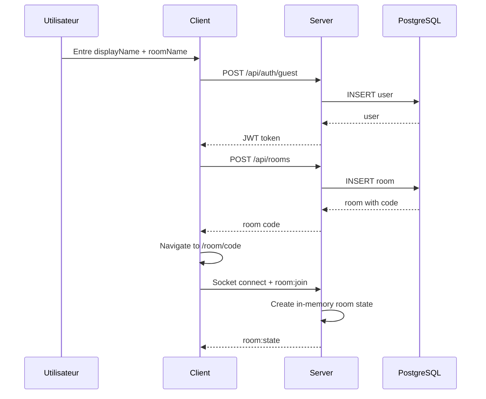
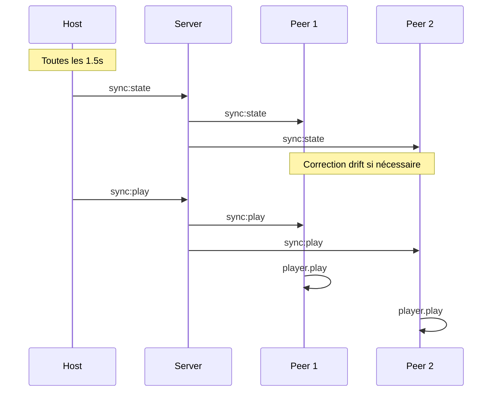

# Analyse Complète du Projet StreamParty

## Vue d'ensemble

**StreamParty** est une application web de streaming collaboratif ("watch-together") permettant à plusieurs utilisateurs de regarder des vidéos en synchronisation temps réel, de chatter et de passer des appels vidéo/audio, le tout directement dans le navigateur.

---

## Architecture du Projet

### Structure Monorepo

```
stream-party/
├── client/          # Frontend React 19 + Vite
├── server/          # Backend Express + Socket.IO
├── shared/          # Types et schemas partagés
└── package.json     # Configuration workspaces npm
```

### Stack Technique

| Couche | Technologies |
|--------|-------------|
| **Frontend** | React 19, Vite 6, Tailwind CSS 3, Video.js 8, Zustand 5 |
| **Backend** | Node.js, Express 4, Socket.IO 4, Drizzle ORM |
| **Streaming** | WebTorrent (browser), simple-peer (WebRTC) |
| **Base de données** | PostgreSQL 16 |
| **Temps réel** | Socket.IO (sync, chat, signaling WebRTC) |
| **Validation** | Zod (schemas partagés) |

---

## Composants Principaux

### 1. Client (Frontend)

#### Pages
- [`HomePage.tsx`](client/src/pages/HomePage.tsx) - Page d'accueil avec création/rejoindre une room
- [`RoomPage.tsx`](client/src/pages/RoomPage.tsx) - Page principale de visionnage (688 lignes, composant central)
- [`DiscoverPage.tsx`](client/src/pages/DiscoverPage.tsx) - Découverte de contenu via addons Stremio
- [`NotFoundPage.tsx`](client/src/pages/NotFoundPage.tsx) - Page 404

#### Stores Zustand
- [`authStore.ts`](client/src/stores/authStore.ts) - Authentification (token, userId, displayName) avec persistance localStorage
- [`roomStore.ts`](client/src/stores/roomStore.ts) - État de la room (participants, syncState, magnetUri)
- [`chatStore.ts`](client/src/stores/chatStore.ts) - Messages, typing indicators, pagination

#### Services
- [`socket.ts`](client/src/services/socket.ts) - Connexion Socket.IO avec reconnexion automatique
- [`syncEngine.ts`](client/src/services/syncEngine.ts) - **Cœur de la synchronisation vidéo**
- [`webtorrent.ts`](client/src/services/webtorrent.ts) - Gestion des torrents et streaming
- [`peerManager.ts`](client/src/services/peerManager.ts) - Gestion des connexions WebRTC
- [`api.ts`](client/src/services/api.ts) - Appels API REST

#### Composants UI
- **video/**: VideoPlayer, MagnetInput, FileSelector, TorrentStatus, PlayerControls
- **chat/**: ChatPanel, MessageList, MessageBubble, ChatInput, TypingIndicator
- **call/**: CallOverlay, CallControls, VideoThumbnail
- **room/**: ShareModal, ParticipantList
- **ui/**: Button, Input, Modal, Avatar, Toast

### 2. Server (Backend)

#### Routes REST
- [`auth.ts`](server/src/routes/auth.ts) - Authentification guest (POST /api/auth/guest)
- [`rooms.ts`](server/src/routes/rooms.ts) - CRUD rooms, ICE servers
- [`addons.ts`](server/src/routes/addons.ts) - Proxy addons Stremio

#### Handlers Socket.IO
- [`room.handler.ts`](server/src/socket/handlers/room.handler.ts) - Join/leave rooms, set magnet, select file
- [`sync.handler.ts`](server/src/socket/handlers/sync.handler.ts) - Synchronisation play/pause/seek
- [`chat.handler.ts`](server/src/socket/handlers/chat.handler.ts) - Messages, typing, historique
- [`rtc.handler.ts`](server/src/socket/handlers/rtc.handler.ts) - Signaling WebRTC

#### État en mémoire
- [`roomState.ts`](server/src/socket/roomState.ts) - Gestion des rooms actives, participants, sync state

### 3. Shared (Types Partagés)

- [`types.ts`](shared/src/types.ts) - Interfaces User, Room, Message, SyncState, Socket Events, constantes

---

## Modèle de Données

### Schéma PostgreSQL (Drizzle)

```typescript
// users - Utilisateurs (guest uniquement)
users: {
  id: uuid (PK),
  displayName: text,
  isGuest: boolean (default true),
  createdAt: timestamp
}

// rooms - Salles de visionnage
rooms: {
  id: uuid (PK),
  code: text (unique, 6 chars),
  name: text,
  hostId: uuid (FK -> users),
  magnetUri: text (nullable),
  selectedFileIndex: integer (nullable),
  isActive: boolean,
  maxParticipants: integer (default 6),
  createdAt: timestamp
}

// messages - Chat persistant
messages: {
  id: uuid (PK),
  roomId: uuid (FK -> rooms),
  userId: uuid (FK -> users),
  content: text,
  createdAt: timestamp
}

// room_participants - Participants actifs
roomParticipants: {
  id: uuid (PK),
  roomId: uuid (FK -> rooms),
  userId: uuid (FK -> users),
  joinedAt: timestamp,
  isActive: boolean
}
```

---

## Fonctionnalités Clés

### 1. Synchronisation Vidéo (Algorithme Host-Autoritaire)

Le host est autoritaire et broadcast son état toutes les 1.5 secondes via [`SYNC_INTERVAL_MS`](shared/src/types.ts:126).

#### Correction de Drift

| Drift | Action |
|-------|--------|
| < 100ms | Aucune action |
| 100-500ms | Ajustement vitesse (1.05x ou 0.95x) |
| > 500ms | Seek forcé |

#### Événements Discrets
- `sync:play` - Play immédiat relayé aux peers
- `sync:pause` - Pause immédiate relayée aux peers
- `sync:seek` - Seek immédiat relayé aux peers
- `sync:buffer` - Signalement de buffering

**Implémentation**: [`SyncEngine`](client/src/services/syncEngine.ts:6) côté client

### 2. Streaming WebTorrent

- Ajout de torrent via lien magnet
- Sélection automatique des fichiers vidéo (mp4, mkv, avi, webm, mov, m4v)
- Support multi-fichiers avec modal de sélection
- Statistiques: downloadSpeed, uploadSpeed, progress, numPeers

**Implémentation**: [`WebTorrentService`](client/src/services/webtorrent.ts:18)

### 3. Appels Vidéo/Audio WebRTC

#### Topologie Mesh
- Maximum 6 participants
- Chaque participant se connecte à tous les autres
- Signaling via Socket.IO (offer/answer/ICE)

#### Flux de Connexion
```
User A rejoint l'appel
    ↓
Socket.IO: rtc:join-call
    ↓
Participants existants créent des peers (initiator=true)
    ↓
Signal: offer → Socket.IO → rtc:offer
    ↓
User A crée peer (initiator=false)
    ↓
Signal: answer → Socket.IO → rtc:answer
    ↓
Échange ICE candidates
    ↓
Connexion WebRTC établie
```

**Implémentation**: [`PeerManager`](client/src/services/peerManager.ts:14)

### 4. Chat en Temps Réel

- Messages persistés en base
- Indicateurs de frappe
- Historique avec pagination (cursor-based)
- Rate limiting: 5 messages / 3 secondes

### 5. Intégration Stremio Addons

- Installation d'addons compatibles Stremio
- Proxy des requêtes catalog/meta/stream
- Agrégation des streams depuis plusieurs addons
- Page Discover pour parcourir le contenu

---

## Flux de Données

### Création d'une Room



### Synchronisation Vidéo



---

## Points d'Attention

### Forces
1. **Architecture propre** - Séparation claire client/server/shared
2. **Types partagés** - Typage TypeScript end-to-end
3. **Synchronisation robuste** - Algorithme de correction de drift bien conçu
4. **WebRTC mesh** - Solution simple pour petit groupe (max 6)
5. **Persistance** - Chat et rooms persistés en base

### Limitations Connues
1. **Topologie mesh** - Ne scale pas au-delà de 6 participants (O(n²) connexions)
2. **État en mémoire** - Les rooms actives sont perdues au redémarrage serveur
3. **Authentification** - Guest uniquement, pas de comptes persistants
4. **TURN server** - Dépend de Xirsys pour la production (coût)

### Tests
- Tests unitaires présents: [`syncEngine.test.ts`](client/src/services/__tests__/syncEngine.test.ts), [`roomState.test.ts`](server/src/socket/__tests__/roomState.test.ts)
- Framework: Vitest

---

## Configuration

### Variables d'Environnement

```bash
# Server (.env)
DATABASE_URL=postgresql://...
JWT_SECRET=...
CLIENT_URL=http://localhost:5173
PORT=3001
XIRSYS_CHANNEL=...  # Pour TURN servers
```

### Docker Compose

PostgreSQL 16 configuré avec:
- Database: streamparty
- User: streamparty
- Password: streamparty_dev
- Port: 5432

---

## Commandes Utiles

```bash
# Développement
npm run dev              # Client + Server
npm run dev:client       # Client uniquement
npm run dev:server       # Server uniquement

# Base de données
npm run db:push -w server    # Push schema Drizzle
npm run db:generate -w server # Générer migrations

# Tests
npm run test -w client
npm run test -w server
```

---

## Conclusion

StreamParty est une application bien structurée avec une architecture moderne et des fonctionnalités complètes pour le streaming collaboratif. Le code est propre, typé, et suit les bonnes pratiques React/Node.js. Les principales zones d'amélioration seraient:

1. Ajouter des tests d'intégration
2. Implémenter une persistance de l'état des rooms (Redis)
3. Considérer une topologie SFU pour plus de participants
4. Ajouter une authentification complète (OAuth)
