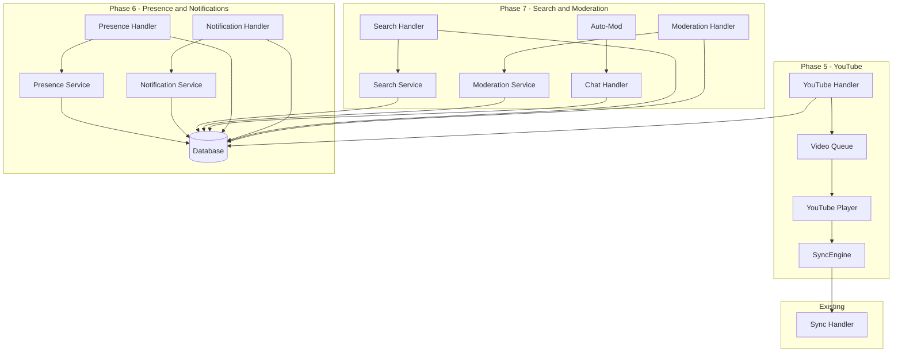
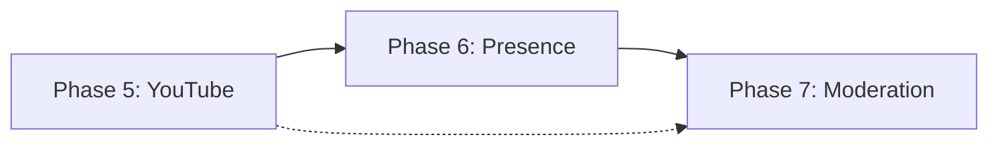

# StreamParty - Phases 5-7 : Plan de Développement

## Vue d'ensemble

Ce document détaille les trois prochaines phases de développement de StreamParty, une plateforme Discord-like pour le visionnage synchronisé de contenus.

---

## Phase 5: Support YouTube

### Objectif
Permettre la lecture synchronisée de vidéos YouTube dans les rooms, en complément du système WebTorrent existant.

### Fonctionnalités Détaillées

#### 5.1 Intégration YouTube Player API
- **Lecteur YouTube intégré** : Remplacer/alterner entre lecteur WebTorrent et YouTube
- **Contrôles synchronisés** : Play, pause, seek synchronisés via le SyncEngine existant
- **Gestion de la qualité** : Sélection automatique de la qualité selon la bande passante

#### 5.2 Système de Queue
- **File d'attente vidéo** : Ajouter plusieurs vidéos à la file
- **Vote skip** : Les participants votent pour passer à la vidéo suivante
- **Historique** : Historique des vidéos jouées dans la room

#### 5.3 Extraction des Métadonnées
- **Récupération des infos** : Titre, description, miniature, durée
- **Affichage enrichi** : Preview de la vidéo avant lecture
- **Support des playlists** : Import de playlists YouTube

### Architecture Technique

#### Nouveaux Fichiers

```
client/
├── src/
│   ├── components/
│   │   └── youtube/
│   │       ├── YouTubePlayer.tsx      # Lecteur YouTube wrapper
│   │       ├── YouTubeQueue.tsx       # Gestion de la file d'attente
│   │       ├── YouTubeSearch.tsx      # Recherche YouTube (optionnel)
│   │       └── VideoPreview.tsx       # Preview avec métadonnées
│   ├── hooks/
│   │   └── useYouTubeSync.ts          # Hook de synchronisation YouTube
│   └── services/
│       └── youtubeService.ts          # API YouTube et extraction métadonnées

server/
├── src/
│   ├── socket/handlers/
│   │   └── youtube.handler.ts         # Events socket pour YouTube
│   ├── services/
│   │   └── youtubeService.ts          # Service backend YouTube API
│   └── routes/
│       └── youtube.ts                 # Routes REST pour métadonnées
```

#### Modifications Existantes

| Fichier | Modification |
|---------|--------------|
| [`shared/src/types.ts`](shared/src/types.ts) | Ajouter types `YouTubeVideo`, `VideoQueue`, `VideoSource` |
| [`server/src/db/schema.ts`](server/src/db/schema.ts) | Tables `video_queue`, `youtube_cache` |
| [`client/src/services/syncEngine.ts`](client/src/services/syncEngine.ts) | Support multi-source (torrent/youtube) |
| [`client/src/components/video/VideoArea.tsx`](client/src/components/video/VideoArea.tsx) | Rendu conditionnel YouTube/WebTorrent |
| [`server/src/socket/index.ts`](server/src/socket/index.ts) | Enregistrement handler YouTube |

### Schéma de Base de Données

```sql
-- Table pour la file d'attente vidéo
CREATE TABLE video_queue (
  id UUID PRIMARY KEY DEFAULT gen_random_uuid(),
  room_id UUID NOT NULL REFERENCES rooms(id) ON DELETE CASCADE,
  added_by UUID NOT NULL REFERENCES users(id),
  source TEXT NOT NULL, -- 'youtube' | 'torrent'
  external_id TEXT, -- YouTube video ID ou magnet URI
  title TEXT NOT NULL,
  thumbnail_url TEXT,
  duration INTEGER, -- en secondes
  position INTEGER NOT NULL DEFAULT 0,
  votes TEXT[] DEFAULT '{}', -- user IDs qui ont voté pour skip
  status TEXT NOT NULL DEFAULT 'pending', -- 'pending' | 'playing' | 'completed' | 'skipped'
  created_at TIMESTAMP NOT NULL DEFAULT NOW()
);

-- Cache des métadonnées YouTube
CREATE TABLE youtube_cache (
  id UUID PRIMARY KEY DEFAULT gen_random_uuid(),
  video_id TEXT NOT NULL UNIQUE,
  title TEXT NOT NULL,
  description TEXT,
  thumbnail_url TEXT,
  duration INTEGER,
  channel_name TEXT,
  view_count INTEGER,
  cached_at TIMESTAMP NOT NULL DEFAULT NOW()
);

-- Index pour performances
CREATE INDEX idx_video_queue_room ON video_queue(room_id);
CREATE INDEX idx_video_queue_status ON video_queue(room_id, status);
CREATE INDEX idx_youtube_cache_video_id ON youtube_cache(video_id);
```

### Types TypeScript

```typescript
// shared/src/types.ts - Ajouts

export type VideoSource = 'torrent' | 'youtube';

export interface YouTubeVideo {
  id: string; // YouTube video ID
  title: string;
  description?: string;
  thumbnailUrl?: string;
  duration: number; // secondes
  channelName?: string;
  viewCount?: number;
}

export interface QueueItem {
  id: string;
  roomId: string;
  addedBy: string;
  source: VideoSource;
  externalId: string | null;
  title: string;
  thumbnailUrl: string | null;
  duration: number | null;
  position: number;
  votes: string[];
  status: 'pending' | 'playing' | 'completed' | 'skipped';
  createdAt: Date;
}

export interface QueueItemWithUser extends QueueItem {
  addedByUser: { displayName: string };
}

// Extension de SyncState
export interface SyncState {
  currentTime: number;
  isPlaying: boolean;
  playbackRate: number;
  timestamp: number;
  magnetUri: string | null;
  selectedFileIndex: number | null;
  // Nouveaux champs
  videoSource: VideoSource;
  youtubeVideoId: string | null;
  queueItemId: string | null;
}
```

### Événements Socket

```typescript
// Client -> Server
'youtube:add-to-queue': (data: { videoId: string }) => void;
'youtube:remove-from-queue': (data: { itemId: string }) => void;
'youtube:vote-skip': (data: { itemId: string }) => void;
'youtube:reorder-queue': (data: { itemId: string; newPosition: number }) => void;
'youtube:play-next': () => void;

// Server -> Client
'youtube:queue-updated': (queue: QueueItemWithUser[]) => void;
'youtube:now-playing': (item: QueueItemWithUser) => void;
'youtube:video-ended': () => void;
'youtube:metadata': (data: YouTubeVideo) => void;
```

### Dépendances Nécessaires

```json
{
  "client": {
    "youtube-player": "^5.5.0",
    "@types/youtube": "^0.0.46"
  },
  "server": {
    "googleapis": "^118.0.0"
  }
}
```

### Points d'Intégration

1. **SyncEngine** : Étendre pour gérer deux types de lecteurs
2. **VideoArea** : Rendu conditionnel selon `videoSource`
3. **Room State** : Stocker la source actuelle et l'ID YouTube
4. **Chat** : Commandes `!play <url>`, `!skip`, `!queue`

### Complexité
**Moyenne** - Intégration API externe, modifications SyncEngine, nouveau système de queue

---

## Phase 6: Notifications et Présence

### Objectif
Implémenter un système complet de notifications et d'indicateurs de présence des utilisateurs.

### Fonctionnalités Détaillées

#### 6.1 Système de Présence
- **Statuts utilisateur** : En ligne, Absent, Ne pas déranger, Hors ligne
- **Indicateurs visuels** : Badge coloré sur les avatars
- **Activité automatique** : Détection d'inactivité, changement automatique de statut
- **Activité en cours** : "En train de regarder X", "Dans un vocal"

#### 6.2 Notifications Push
- **Notifications navigateur** : Via l'existant [`useNotifications`](client/src/hooks/useNotifications.ts)
- **Notifications in-app** : Centre de notifications avec historique
- **Préférences** : Configuration par type de notification
- **Mentions** : @username dans le chat avec notification

#### 6.3 Notifications par Type
- **Messages** : Nouveau message dans channel suivi
- **Mentions** : @username dans n'importe quel channel
- **Vocal** : Quelqu'un rejoint un canal vocal
- **Événements room** : Vidéo ajoutée, lecture terminée
- **Système** : Nouveau membre dans le serveur

### Architecture Technique

#### Nouveaux Fichiers

```
client/
├── src/
│   ├── components/
│   │   ├── presence/
│   │   │   ├── PresenceIndicator.tsx   # Badge de statut
│   │   │   ├── UserStatusSelector.tsx   # Sélecteur de statut
│   │   │   └── ActivityStatus.tsx       # Activité en cours
│   │   └── notifications/
│   │       ├── NotificationBell.tsx     # Icône avec compteur
│   │       ├── NotificationPanel.tsx    # Panel dropdown
│   │       ├── NotificationItem.tsx     # Item individuel
│   │       └── NotificationSettings.tsx # Préférences
│   ├── hooks/
│   │   └── usePresence.ts               # Hook de gestion présence
│   └── stores/
│       └── notificationStore.ts         # Store notifications

server/
├── src/
│   ├── socket/handlers/
│   │   ├── presence.handler.ts          # Events présence
│   │   └── notification.handler.ts      # Events notifications
│   ├── services/
│   │   ├── presenceService.ts           # Logique présence
│   │   └── notificationService.ts       # Logique notifications
│   └── routes/
│       └── notifications.ts             # API REST notifications
```

#### Modifications Existantes

| Fichier | Modification |
|---------|--------------|
| [`shared/src/types.ts`](shared/src/types.ts) | Types `UserPresence`, `Notification`, `UserStatus` |
| [`server/src/db/schema.ts`](server/src/db/schema.ts) | Tables `user_presence`, `notifications`, `notification_preferences` |
| [`client/src/stores/authStore.ts`](client/src/stores/authStore.ts) | Ajout statut présence |
| [`client/src/components/ui/Avatar.tsx`](client/src/components/ui/Avatar.tsx) | Indicateur de présence |
| [`server/src/socket/index.ts`](server/src/socket/index.ts) | Handlers présence/notifications |

### Schéma de Base de Données

```sql
-- Statut de présence utilisateur
CREATE TABLE user_presence (
  id UUID PRIMARY KEY DEFAULT gen_random_uuid(),
  user_id UUID NOT NULL UNIQUE REFERENCES users(id),
  status TEXT NOT NULL DEFAULT 'online', -- 'online' | 'idle' | 'dnd' | 'offline'
  custom_status TEXT, -- Message personnalisé
  current_activity JSONB, -- { type: 'watching' | 'voice', details: '...' }
  last_seen_at TIMESTAMP NOT NULL DEFAULT NOW(),
  updated_at TIMESTAMP NOT NULL DEFAULT NOW()
);

-- Notifications
CREATE TABLE notifications (
  id UUID PRIMARY KEY DEFAULT gen_random_uuid(),
  user_id UUID NOT NULL REFERENCES users(id) ON DELETE CASCADE,
  type TEXT NOT NULL, -- 'mention' | 'message' | 'voice_join' | 'system' | 'room_event'
  title TEXT NOT NULL,
  content TEXT,
  data JSONB, -- Données additionnelles (channelId, messageId, etc.)
  read_at TIMESTAMP,
  created_at TIMESTAMP NOT NULL DEFAULT NOW()
);

-- Préférences de notification
CREATE TABLE notification_preferences (
  id UUID PRIMARY KEY DEFAULT gen_random_uuid(),
  user_id UUID NOT NULL UNIQUE REFERENCES users(id) ON DELETE CASCADE,
  mention_enabled BOOLEAN NOT NULL DEFAULT true,
  message_enabled BOOLEAN NOT NULL DEFAULT true,
  voice_enabled BOOLEAN NOT NULL DEFAULT true,
  room_event_enabled BOOLEAN NOT NULL DEFAULT true,
  system_enabled BOOLEAN NOT NULL DEFAULT true,
  push_enabled BOOLEAN NOT NULL DEFAULT true,
  created_at TIMESTAMP NOT NULL DEFAULT NOW(),
  updated_at TIMESTAMP NOT NULL DEFAULT NOW()
);

-- Index pour performances
CREATE INDEX idx_notifications_user ON notifications(user_id);
CREATE INDEX idx_notifications_unread ON notifications(user_id) WHERE read_at IS NULL;
CREATE INDEX idx_presence_status ON user_presence(status);
CREATE INDEX idx_presence_last_seen ON user_presence(last_seen_at);
```

### Types TypeScript

```typescript
// shared/src/types.ts - Ajouts

export type UserStatus = 'online' | 'idle' | 'dnd' | 'offline';

export interface UserPresence {
  userId: string;
  status: UserStatus;
  customStatus: string | null;
  currentActivity: Activity | null;
  lastSeenAt: Date;
}

export interface Activity {
  type: 'watching' | 'listening' | 'voice' | 'playing';
  details: string;
  roomId?: string;
  channelId?: string;
}

export type NotificationType = 'mention' | 'message' | 'voice_join' | 'room_event' | 'system';

export interface Notification {
  id: string;
  userId: string;
  type: NotificationType;
  title: string;
  content: string | null;
  data: Record<string, unknown> | null;
  readAt: Date | null;
  createdAt: Date;
}

export interface NotificationPreferences {
  mentionEnabled: boolean;
  messageEnabled: boolean;
  voiceEnabled: boolean;
  roomEventEnabled: boolean;
  systemEnabled: boolean;
  pushEnabled: boolean;
}
```

### Événements Socket

```typescript
// Client -> Server
'presence:update-status': (data: { status: UserStatus; customStatus?: string }) => void;
'presence:set-activity': (data: Activity | null) => void;
'notification:mark-read': (data: { notificationId: string }) => void;
'notification:mark-all-read': () => void;
'notification:update-preferences': (data: Partial<NotificationPreferences>) => void;

// Server -> Client
'presence:user-status': (data: { userId: string; presence: UserPresence }) => void;
'presence:bulk-status': (data: { [userId: string]: UserPresence }) => void;
'notification:new': (data: Notification) => void;
'notification:unread-count': (count: number) => void;
```

### Dépendances Nécessaires

```json
{
  "server": {
    "node-cron": "^3.0.0"
  }
}
```

### Points d'Intégration

1. **Avatar Component** : Ajouter l'indicateur coloré
2. **Auth Store** : Gérer le statut de l'utilisateur courant
3. **Chat Handler** : Détecter les @mentions et créer notifications
4. **Voice Handler** : Notifications quand quelqu'un rejoint
5. **Activity Detection** : Timer côté client pour statut idle

### Complexité
**Moyenne** - Plusieurs tables, système de préférences, intégration UI multiple

---

## Phase 7: Recherche et Modération

### Objectif
Implémenter la recherche de messages et les outils de modération pour les serveurs.

### Fonctionnalités Détaillées

#### 7.1 Recherche de Messages
- **Recherche full-text** : Recherche dans le contenu des messages
- **Filtres avancés** : Par utilisateur, par date, par channel
- **Résultats contextuels** : Affichage du message avec contexte
- **Recherche globale** : Tous les channels accessibles

#### 7.2 Outils de Modération
- **Gestion des rôles** : Création, modification, suppression de rôles personnalisés
- **Permissions granulaires** : Par channel et par rôle
- **Actions de modération** :
  - Avertissement (warn)
  - Mute temporaire
  - Kick du serveur
  - Ban du serveur
- **Logs de modération** : Historique des actions

#### 7.3 Auto-Modération
- **Filtre de mots interdits** : Liste configurable
- **Spam protection** : Détection de spam automatique
- **Slow mode** : Limitation de fréquence de messages par channel

### Architecture Technique

#### Nouveaux Fichiers

```
client/
├── src/
│   ├── components/
│   │   ├── search/
│   │   │   ├── SearchBar.tsx           # Barre de recherche
│   │   │   ├── SearchResults.tsx       # Résultats de recherche
│   │   │   └── SearchFilters.tsx       # Filtres avancés
│   │   └── moderation/
│   │       ├── ModerationPanel.tsx     # Panel de modération
│   │       ├── RoleManager.tsx         # Gestion des rôles
│   │       ├── PermissionEditor.tsx    # Éditeur de permissions
│   │       ├── ModerationLogs.tsx      # Historique des actions
│   │       └── UserContextMenu.tsx     # Menu contextuel utilisateur
│   ├── hooks/
│   │   ├── useSearch.ts                # Hook de recherche
│   │   └── useModeration.ts            # Hook de modération
│   └── stores/
│       └── moderationStore.ts          # Store modération

server/
├── src/
│   ├── socket/handlers/
│   │   ├── search.handler.ts           # Events recherche
│   │   └── moderation.handler.ts       # Events modération
│   ├── services/
│   │   ├── searchService.ts            # Service de recherche
│   │   └── moderationService.ts        # Service de modération
│   ├── routes/
│   │   ├── search.ts                   # API REST recherche
│   │   └── moderation.ts               # API REST modération
│   └── middleware/
│       └── permissions.ts              # Middleware permissions
```

#### Modifications Existantes

| Fichier | Modification |
|---------|--------------|
| [`shared/src/types.ts`](shared/src/types.ts) | Types `Role`, `Permission`, `ModerationAction`, `SearchResult` |
| [`server/src/db/schema.ts`](server/src/db/schema.ts) | Tables `roles`, `permissions`, `moderation_logs`, `muted_users` |
| [`server/src/socket/handlers/chat.handler.ts`](server/src/socket/handlers/chat.handler.ts) | Intégration auto-modération |
| [`client/src/components/chat/MessageBubble.tsx`](client/src/components/chat/MessageBubble.tsx) | Menu contextuel modération |
| [`client/src/components/server/ServerSettings.tsx`](client/src/components/server/ServerSettings.tsx) | Onglet modération |

### Schéma de Base de Données

```sql
-- Rôles personnalisés
CREATE TABLE roles (
  id UUID PRIMARY KEY DEFAULT gen_random_uuid(),
  server_id UUID NOT NULL REFERENCES servers(id) ON DELETE CASCADE,
  name TEXT NOT NULL,
  color TEXT NOT NULL DEFAULT '#99AAB5',
  position INTEGER NOT NULL DEFAULT 0,
  permissions JSONB NOT NULL DEFAULT '{}',
  created_at TIMESTAMP NOT NULL DEFAULT NOW()
);

-- Permissions par channel
CREATE TABLE channel_permissions (
  id UUID PRIMARY KEY DEFAULT gen_random_uuid(),
  channel_id UUID NOT NULL REFERENCES channels(id) ON DELETE CASCADE,
  role_id UUID NOT NULL REFERENCES roles(id) ON DELETE CASCADE,
  allow BIGINT NOT NULL DEFAULT 0,
  deny BIGINT NOT NULL DEFAULT 0,
  UNIQUE(channel_id, role_id)
);

-- Logs de modération
CREATE TABLE moderation_logs (
  id UUID PRIMARY KEY DEFAULT gen_random_uuid(),
  server_id UUID NOT NULL REFERENCES servers(id) ON DELETE CASCADE,
  action TEXT NOT NULL, -- 'warn' | 'mute' | 'kick' | 'ban'
  target_user_id UUID NOT NULL REFERENCES users(id),
  moderator_id UUID NOT NULL REFERENCES users(id),
  reason TEXT,
  duration INTEGER, -- en minutes pour mute temporaire
  created_at TIMESTAMP NOT NULL DEFAULT NOW()
);

-- Utilisateurs mute
CREATE TABLE muted_users (
  id UUID PRIMARY KEY DEFAULT gen_random_uuid(),
  server_id UUID NOT NULL REFERENCES servers(id) ON DELETE CASCADE,
  user_id UUID NOT NULL REFERENCES users(id),
  muted_until TIMESTAMP NOT NULL,
  created_at TIMESTAMP NOT NULL DEFAULT NOW(),
  UNIQUE(server_id, user_id)
);

-- Utilisateurs bannis
CREATE TABLE banned_users (
  id UUID PRIMARY KEY DEFAULT gen_random_uuid(),
  server_id UUID NOT NULL REFERENCES servers(id) ON DELETE CASCADE,
  user_id UUID NOT NULL REFERENCES users(id),
  banned_by UUID NOT NULL REFERENCES users(id),
  reason TEXT,
  created_at TIMESTAMP NOT NULL DEFAULT NOW(),
  UNIQUE(server_id, user_id)
);

-- Configuration auto-modération
CREATE TABLE auto_mod_config (
  id UUID PRIMARY KEY DEFAULT gen_random_uuid(),
  server_id UUID NOT NULL UNIQUE REFERENCES servers(id) ON DELETE CASCADE,
  banned_words TEXT[] DEFAULT '{}',
  spam_threshold INTEGER DEFAULT 5,
  spam_interval_seconds INTEGER DEFAULT 5,
  slow_mode_seconds INTEGER DEFAULT 0,
  created_at TIMESTAMP NOT NULL DEFAULT NOW(),
  updated_at TIMESTAMP NOT NULL DEFAULT NOW()
);

-- Index pour performances
CREATE INDEX idx_roles_server ON roles(server_id);
CREATE INDEX idx_mod_logs_server ON moderation_logs(server_id);
CREATE INDEX idx_mod_logs_target ON moderation_logs(target_user_id);
CREATE INDEX idx_muted_users_server ON muted_users(server_id);
CREATE INDEX idx_banned_users_server ON banned_users(server_id);
-- Index full-text pour recherche
CREATE INDEX idx_messages_content_fts ON messages USING gin(to_tsvector('french', content));
```

### Types TypeScript

```typescript
// shared/src/types.ts - Ajouts

// Système de permissions (bitwise flags)
export const PERMISSION_FLAGS = {
  VIEW_CHANNEL: 1 << 0,
  SEND_MESSAGES: 1 << 1,
  MANAGE_MESSAGES: 1 << 2,
  EMBED_LINKS: 1 << 3,
  ATTACH_FILES: 1 << 4,
  CONNECT_VOICE: 1 << 5,
  SPEAK_VOICE: 1 << 6,
  MUTE_MEMBERS: 1 << 7,
  DEAFEN_MEMBERS: 1 << 8,
  MANAGE_CHANNELS: 1 << 9,
  MANAGE_ROLES: 1 << 10,
  KICK_MEMBERS: 1 << 11,
  BAN_MEMBERS: 1 << 12,
  ADMINISTRATOR: 1 << 13,
} as const;

export type PermissionFlag = keyof typeof PERMISSION_FLAGS;

export interface Role {
  id: string;
  serverId: string;
  name: string;
  color: string;
  position: number;
  permissions: number; // Bitwise flags
  createdAt: Date;
}

export interface ChannelPermission {
  channelId: string;
  roleId: string;
  allow: number;
  deny: number;
}

export type ModerationAction = 'warn' | 'mute' | 'kick' | 'ban';

export interface ModerationLog {
  id: string;
  serverId: string;
  action: ModerationAction;
  targetUserId: string;
  moderatorId: string;
  reason: string | null;
  duration: number | null;
  createdAt: Date;
}

export interface ModerationLogWithUsers extends ModerationLog {
  targetUser: { displayName: string };
  moderator: { displayName: string };
}

export interface SearchResult {
  message: ChatMessage;
  highlights: string; // Texte avec correspondances surlignées
  score: number;
}

export interface SearchFilters {
  userId?: string;
  channelId?: string;
  serverId?: string;
  fromDate?: Date;
  toDate?: Date;
  hasAttachments?: boolean;
}

export interface AutoModConfig {
  serverId: string;
  bannedWords: string[];
  spamThreshold: number;
  spamIntervalSeconds: number;
  slowModeSeconds: number;
}
```

### Événements Socket

```typescript
// Client -> Server
'search:messages': (data: { query: string; filters?: SearchFilters }, cb: (results: SearchResult[]) => void) => void;
'moderation:warn': (data: { userId: string; reason?: string }) => void;
'moderation:mute': (data: { userId: string; duration: number; reason?: string }) => void;
'moderation:kick': (data: { userId: string; reason?: string }) => void;
'moderation:ban': (data: { userId: string; reason?: string }) => void;
'moderation:unmute': (data: { userId: string }) => void;
'moderation:unban': (data: { userId: string }) => void;
'role:create': (data: { name: string; color: string; permissions: number }) => void;
'role:update': (data: { roleId: string; updates: Partial<Role> }) => void;
'role:delete': (data: { roleId: string }) => void;
'role:assign': (data: { userId: string; roleId: string }) => void;
'role:remove': (data: { userId: string; roleId: string }) => void;

// Server -> Client
'moderation:user-warned': (data: { userId: string; reason: string | null }) => void;
'moderation:user-muted': (data: { userId: string; until: Date }) => void;
'moderation:user-kicked': (data: { userId: string; reason: string | null }) => void;
'moderation:user-banned': (data: { userId: string; reason: string | null }) => void;
'moderation:auto-deleted': (data: { messageId: string; reason: string }) => void;
'role:created': (data: Role) => void;
'role:updated': (data: Role) => void;
'role:deleted': (data: { roleId: string }) => void;
```

### Dépendances Nécessaires

```json
{
  "server": {
    "ts-vector": "^1.0.0"
  }
}
```

### Points d'Intégration

1. **Chat Handler** : Vérification permissions, auto-modération
2. **MessageBubble** : Menu contextuel pour actions de modération
3. **Server Settings** : Nouvel onglet "Modération"
4. **Auth Middleware** : Vérification permissions par route
5. **Database** : Migration pour index full-text

### Complexité
**Élevée** - Système de permissions complexe, recherche full-text, multiples handlers

---

## Diagramme d'Architecture Global



---

## Ordre de Dépendance des Phases



**Recommandation** : Implémenter dans l'ordre 5 → 6 → 7 car :
1. Phase 5 étend le cœur (SyncEngine) sans dépendances
2. Phase 6 ajoute la couche utilisateur nécessaire pour la modération
3. Phase 7 utilise les deux phases précédentes (présence pour logs, vidéo pour modération)

---

## Résumé des Complexités

| Phase | Complexité | Tables DB | Nouveaux Handlers |
|-------|------------|-----------|-------------------|
| 5 - YouTube | Moyenne | 2 | 1 |
| 6 - Presence/Notifications | Moyenne | 3 | 2 |
| 7 - Search/Moderation | Élevée | 6 | 2 |

---

## Prochaines Étapes

1. **Validation du plan** : Revue avec l'équipe
2. **Migration DB** : Préparer les migrations pour chaque phase
3. **Branches de développement** : Créer `feature/phase-5-youtube`, etc.
4. **Tests** : Plan de tests pour chaque fonctionnalité
